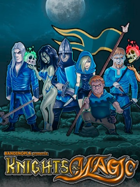
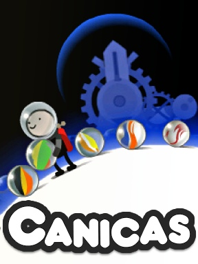
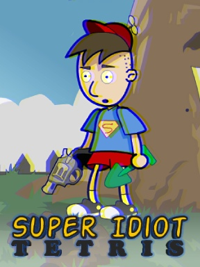

### Hi there 👋
I'm a Full Stack Web Dev & casual Game Dev, creator of the site ⚡[weightxreps.net](https://weightxreps.net/) and also a bit of a [3D Character Artist](https://www.artstation.com/bandinopla)  
--- 

<table>
    <tr>
    <td><b>Game Dev Reel</b>

    </td> 
    <td><b>3D Art Reel</b>

    </td>
    </tr>
</table>

--- 

#### :video_game: Games
  
<table>
    <tr>
    <td></td> 
        <td></td>
        <td></td>
        <td></td>   
        <td>
        </td> 
        <td></td>
        <td></td> 
    </tr>
</table>

#### :iphone: Android Apps

<table background="white"> 
  <tr>
    <td width="120"></td>  
    <td width="120"></td>  
  </tr> 
</table> 

#### :globe_with_meridians: Public modules

*  [**threejs-gif-texture**](https://github.com/bandinopla/threejs-gif-texture) : Use an animated gif as a Texture in [THREE.js](https://github.com/mrdoob/three.js/) 
*  [**quick_flipbook**](https://github.com/bandinopla/quick_flipbook) : Create a quick [THREE.js](https://github.com/mrdoob/three.js/) flipbook.
*  [**react-text-tokenizer**](https://github.com/bandinopla/react-text-tokenizer) : [React](https://github.com/facebook/react) component to convert a text string into React Nodes using tokens.
*  [**quick_router**](https://github.com/bandinopla/quick_router): A quick routing mechanism for [Flutter](https://flutter.dev/) to handle deep linking in a hurry.  

<!--
- 🔭 I’m currently working on ...
- 🌱 I’m currently learning ...
- 👯 I’m looking to collaborate on ...
- 🤔 I’m looking for help with ...
- 💬 Ask me about ...
- 📫 How to reach me: ...
- 😄 Pronouns: ...
- ⚡ Fun fact: ...
-->

